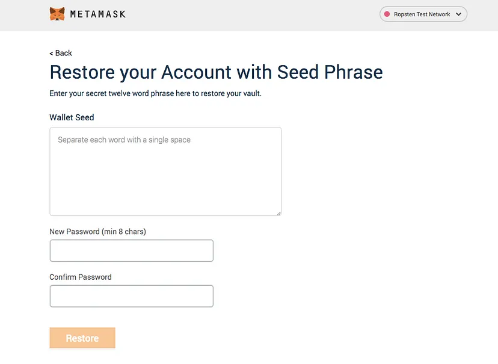

# Web 7.0 Portable Trust Library (PTL)

The Web 7.0 Portable Trust Library (PTL) is used to provide software support for the trust operations required to develop Web 7.0 Trusted Personal Agents (and supporting components) across multiple operating system environments. THe PTL is a free, open source software project available using the MIT License.

The list of PTL trust operations includes:
- Key generation, serialization and persistence (Signer and Encrypter)
- Asymmetric digital signature creation and validation (Signer and Hasher)
- Asymmetric encryption and decryption (Encrypter)
- Symmetric encryption and decryption (SymEncrypter)
- JWE-based authenticated encryption (JWEMessagePacker)
- DID Document creation and management (DIDDocumenter)
- DID Registry-based DID Document registration and retrieval (DIDRegistrar)
- DIDComm message creation (DIDComm)
- DIDComm message transmission (HTTPTransporter)
- VDR-based signature authentication (Notary)
- Trust Registry TrustReg document management
- BIP39-compliant mnemonic phrase and seed generation

The TPL trust operations are factored into 5 namespaces:
1. Web7.TrustLibrary.Base
2. Web7.TrustLibrary.Did
3. Web7.TrustLibrary.Registries
4. Web7.TrustLibrary.Transports
5. Web7.TrustLibrary.NBitcoin 

The sample code for a DIDComm Agent can be found here: https://github.com/Web7Foundation/Web7.TrustLibrary/tree/main/src/Web7.TrustedPersonalAgent1 

The PTL supports the Web 7.0 Foundation's goal of "making decentralized systems development easy-to-understand and easier for you to implement as well as easier for you explain to other developers". Rather than trying to be _object-oriented_ in its design, the PTL leverages the concept of [_anthropomorphic_ (software actor-based) design](https://bajamircea.github.io/coding/cpp/2016/01/08/anthropomorphic-design.html).

GitHub Repository: https://github.com/Web7Foundation/Web7.TrustLibrary 

The mission and goals of Web 7.0 are described here: [Web 7.0: a universal, open-source solution for the Internet’s digital identity and trust problems](https://hyperonomy.com/2023/07/06/web-7-0-a-universal-open-source-solution-for-the-internets-digital-identity-and-trust-problems/).

## Web7.TrustLibrary.Base

### Encrypter

The Encrypter class is used to support a set of public and private keys for encryption and decryption; 
including key generation and serialization.
This class uses asymmetric, public/private key based processing using the RSA algorithm.

The Signer and Encrypter classes are used in the JWEMessagePacker class to create JWETokens.

Keywords: Confidentiality RSA

### Hasher

The Hasher class is used to create Hashes of arbitrary Strings and Byte arrays.

Keywords: Authenticity SHA SHA256 Hash

### Helper

The Helper class contains a number of public static helper or utility methods.

### JWEMessagePacker

The JWEMessagePacker class is used to support the creation, verification, and serialization of JWE tokens. 

This class uses keys created or deserialized from the Signer and Encrypter classes. 

Keywords: Authenticated-Encryption JWE JWE-Token

### Signer

The Signer class can be used to to support the creation of digital signatures for arbitrary Strings and Byte arrays; including key generation and serialization. 
This class uses asymmetric, public/private key based processing using the ECDSA algorithm.

The Signer and Encrypter classes are used in the JWEMessagePacker class to create JWETokens.

Keywords: Authenticity ECDsa Digital-Signature

### SymEncrypter

The SymEncrypter class is used to support symmetric encryption and decryption of the master keys - which, in turn, are used to protect a subject's secret keys (those generated by the Encrypter and Signer classes). 

The storage and encryption of the encrypted subject secret keys is managed by the KeyManager class.

This class uses the NBitcoin.BIT39 Mnemonic classes (included in this package) to generate the master key (salt).

Keywords: Mnemonic Symmetric-Encryption Master-Keys

## Web7.TrustLibrary.Did

### DIDComm Message

The DIDComm Message classes are used to create and serialize an in-memory Web 7.0 DIDComm Message with (or without) a DIDComm Attachment. 
In addition, the DIDComm class can create authenticated encrypted messages by internally using the JWEMessagePacker class.

The HTTPTransporter class is used to transport a DIDCommMessage from a Sender agent's outbound service endpoint to a Receiver 
agent's inbound service endpoint using the HTTP protocol.

Keywords: Secure-Messaging Authenticity Confidentiality DID DID-Communications DIDComm-Messaging

### DIDDocumenter

The DIDDocumenter class takes as inputs a Signer public key, an Encrypter public key, a list of service endpoints, 
and a list of relationships and creates an in-memory DIDDocument. 
In addition, a DIDDocumenter can be used to update as well as serialize an existing, in-memory DIDDocument.

The Registry class is used to persist an in-memory DIDDocument to as well as retrieve a persisted DIDDocument from the DID Registry.

Keywords: DID DID-Document

### DIDDocument (Extension Methods)

The DIDDocument partial class supports the tricky field-based JSON serialization/deserialization needed by users of the DIDDocumenter class.

The underlying DIDDocument partial class is generated from DIDDocument.tsl.

Keywords: DID DID-Document

### JsonWebKeyDotnet6 (Extension Methods)

The JsonWebKeyDotnet6 partial class supports the tricky field-based JSON serialization/deserialization needed by users of the DIDDocumenter class.

The underlying JsonWebKeyDotnet6 partial class is generated from DIDDocument.tsl.

Keywords: DID DID-Document JsonWebKey Dotnet

## Web7.TrustLibrary.Registries

### DIDRegistrar

The DIDRegistrar class is used to register and retrieve a DIDDocument to and from the DID Registry.

The DIDocumenter class is used to create, update and serialized in-memory DIDDocuments

Keywords: DID-Registry DID Decentralized-Identifier

### KeyManager

The KeyManager class is used to manage a collection of Signer and Encrypter key pairs
stored locally on a device in a personal KeyVault.

Keywords: KeyManager KeyVault Key-Storage

### Notary

The Notary class is used to create, serialized, persist, and retrieve Signatures using a Verifiable Data Registry.

This class uses Signatures created or deserialized from the Signer class.

Keywords: Authenticity Verifiable-Data-Registry

### TrustRegistrar

The TrustRegistrar class is used to maintain the collection of relationships in a Trust Registration (TrustReg) document, 
a specialization of a DID Document.
TrustReg documents are stored in a DID Registry managed by the DIDRegistrar class.

The DIDDocumenter and DIDRegistrar classes are used to support the capabilities of the TrustRegistrar class.

Keywords: Trust-Registry DID-Document DID-Registry DID Decentralized-Identifier

## Web7.TrustLibrary.Transports

### HTTPTransporter

The HTTPTransporter class is used to transport a DIDCommMessage from a Sender agent's outbound service endpoint to a Receiver 
agent's inbound service endpoint using the HTTP protocol.

The DIDComm class is used to create and serialize an in-memory Web 7.0 DIDComm Message with (or without) a DIDComm Attachment. 
In addition the DIDComm class can create authenticated encrypted messages by internally using the JWEMessagePacker class.

Keywords: DIDComm HTTP Transport-Protocol

## Web7.TrustLibrary.NBitcoin.BIP39

### Mnemonic

The Mnemonic class (and related classes) implement the [Bitcoin Improvement Proposal 39](https://github.com/bitcoin/bips/blob/master/bip-0039.mediawiki) (BIP39) similar to that used by [Metamask](https://metamask.io/) and other digital wallets:

>[[BIP39](https://github.com/bitcoin/bips/blob/master/bip-0039.mediawiki)] describes the implementation of a mnemonic code or mnemonic sentence — a group of easy to remember words — for the generation of deterministic wallets. It consists of two parts: generating the mnemonic, and converting it into a binary seed." [Credit](https://medium.com/coinmonks/mnemonic-generation-bip39-simply-explained-e9ac18db9477)



This instance of the Mnemonic classes is (more or less) a direct copy of the BIP39 [NBitcoin](https://github.com/MetacoSA/NBitcoin/tree/master/NBitcoin) classes found here:
https://github.com/MetacoSA/NBitcoin/tree/master/NBitcoin/BIP39 (and sibling directories).
The code in this project is a completely independent (standalone) implementation.
These classes do not use or rely any of the other Portable Trust Library classes.
 
NOTE: This project only includes the code necessary to implement BIP39. It is not a fork or a clone of the NBitcoin repository.

Thank you to [Nickolas Dorier](https://www.linkedin.com/in/nicolasdorier/) for creating [NBitcoin](https://github.com/MetacoSA/NBitcoin/tree/master/NBitcoin), the C#/.NET implementation of the Bitcoin libraries.

#### Sample Code

```csharp
using Web7.TrustLibrary.NBitcoin;
using Web7.TrustLibrary.NBitcoin.BIP39;
using Web7.TrustLibrary.NBitcoin.Crypto;
...
    RandomUtils.Random = new UnsecureRandom();
    foreach (var count in new[] { 
        WordCount.Twelve, WordCount.TwentyFour, WordCount.TwentyOne, WordCount.Fifteen, WordCount.Eighteen 
    })
    {
        Mnemonic mnemonic = new Mnemonic(Wordlist.English, count);
        var mnemonicWords = mnemonic.Words;
        string mnemonicString = string.Join(" ", mnemonicWords);
        Console.WriteLine(((int)count).ToString() + ":\t" + mnemonicString);
        byte[] mnemonicHash = Hashes.SHA256(Encoding.UTF8.GetBytes(mnemonicString));
        string mnemonicHash64 = Convert.ToBase64String(mnemonicHash);
        Console.WriteLine(((int)count).ToString() + ":\t" + mnemonicHash64 + " (" + mnemonicHash.Length.ToString() + ")");

        Console.WriteLine(((int)count).ToString() + ":\t" + mnemonic.IsValidChecksum.ToString());

        Mnemonic mnemonic2 = new Mnemonic(mnemonicString);
        Console.WriteLine(((int)count).ToString() + ":\t" + mnemonic2.IsValidChecksum.ToString());

        var indices = mnemonic2.Indices;

        byte[] seedBytes = mnemonic.DeriveSeed("Hello World!");
        string seed64 = Convert.ToBase64String(seedBytes);
        Console.WriteLine(((int)count).ToString() + ":\t" + seed64 + " (" + seedBytes.Length.ToString() + ")");
    }
```